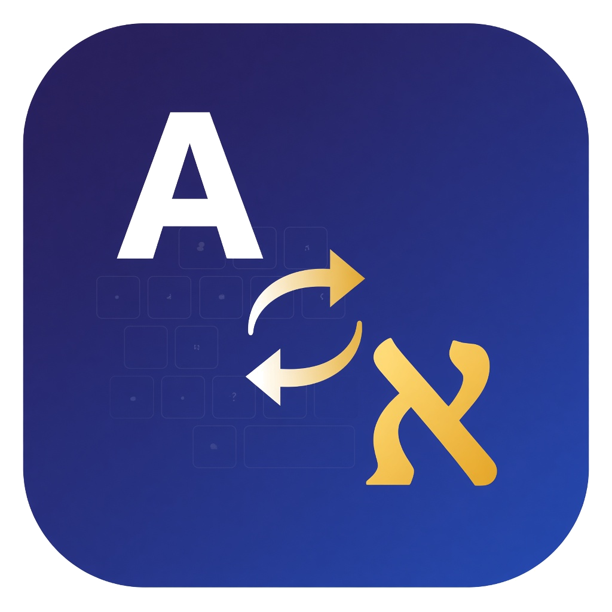

<p align="center">
  
</p>

<h1 align="center">HE↔EN Fixer</h1>

<p align="center">A local tray app for Windows and Mac that fixes the classic mistake: you meant <strong>English</strong>, but the keyboard was still on <strong>Hebrew</strong> — or the other way around.</p>

Example: Hebrew layout is on, you type `hello`, the screen shows `יקךךם`. A moment after you stop typing, the app rewrites it to `hello` and switches your keyboard to English, so you can keep going.

Real words are left alone. `שלום` and `אם` stay Hebrew. `hello` and `to` stay English.

The app runs only on your computer. It does not send your typing to the internet.

---

## Install (one click)

No administrator password. Installs only for the current user. The same window can uninstall it.

### Windows

1. Open `HE-EN-Fixer-Windows.zip`
2. Double-click **Install.bat**
3. Click **Install**
4. Click **Open app**

Windows may show a SmartScreen prompt because this is not from the Microsoft Store. If you trust this copy: **More info → Run anyway**.

### Mac

1. Open `HE-EN-Fixer-macOS.zip`
2. Double-click **Install.command**
3. Click **Install**
4. Allow **Accessibility** in **System Settings → Privacy & Security → Accessibility**
5. Click **Open app**

If macOS says the app is from an unidentified developer: right-click → **Open**.

### From this project folder

If you already have this folder on the computer:

- Windows: double-click `Install.bat`
- Mac: double-click `Install.command`

That copies the app into your user folder and can add a desktop shortcut.

---

## How to use it

After install, the tray icon above appears in the system tray. Leave it running while you type.

**Auto-fix waits until you stop typing.** Nothing changes while your fingers are moving. About a second after your last keystroke, everything you just typed is corrected at once, and your keyboard switches to the language you meant to be typing in.

Two things to know:

- Press **Enter before pausing and nothing is fixed** — in chat apps Enter has already sent the message, so there is no text left to correct. Pause for a moment first, or use the force-convert shortcut below.
- The language switch only happens when something was actually corrected.

**Force convert** if auto-fix misses a name or a rare word, or if you don't want to wait:

| | Windows | Mac |
|---|---|---|
| Convert what you just typed | **Ctrl+Space**, **Pause**, or **F9** | **Ctrl+Shift+Space** or **F9** |
| Convert selected text | Same shortcut, with text selected | Same |

On a Mac, Ctrl+Space is not used, so it does not steal the language-switch shortcut.

Right-click the tray icon to:

- Turn the fixer on or off
- Turn auto-fix on or off
- Turn the keyboard-language switch on or off
- Allow only Hebrew → English, only English → Hebrew, or both
- Start when you log in
- Open **Settings…** or the install / uninstall window
- Quit

Turn it off from the tray before passwords, games, or mixed-language typing you want left as-is.

---

## Settings

Tray icon → **Settings…** opens a small window for everything you can tune:

| Setting | What it does |
|---|---|
| Fixer is on | Master switch |
| Fix what I typed when I stop typing | Turns auto-fix off without stopping the app |
| How long to wait | Pause length before a fix runs, from 0.3 to 3 seconds (default 1.2). **Calibrate from my typing…** times the gaps between your letters and words and sets this for you. |
| Switch my keyboard… | Change the input language after a correction |
| Allowed corrections | Hebrew → English, English → Hebrew, or both |
| Start when I log in | Launch the app at login |

Saving applies immediately — the running app picks the change up, so there is no need to restart it.

Settings are stored as plain JSON, if you prefer editing by hand:

- Windows: `%APPDATA%\he-en-fixer\settings.json`
- Mac: `~/Library/Application Support/he-en-fixer/settings.json`

---

## Uninstall

Double-click **Install.bat** (Windows) or **Install.command** (Mac), then click **Uninstall**.

Or: tray icon → **Install / Uninstall…** → **Uninstall**.

---

## Safety

- Installs only under your user folder
  - Windows: `%LOCALAPPDATA%\HE-EN Fixer`
  - Mac: `~/Library/Application Support/he-en-fixer`
- Does not need administrator rights
- Does not send keystrokes over the network
- Source is MIT licensed — you can read what it does

---

## Share it with other people

Send the zip, not the whole source tree.

**Windows zip** (build on a Windows PC):

```bat
packaging\build_windows.ps1
```

The file to send is `release\HE-EN-Fixer-Windows.zip`.

**Mac zip** must be built on a Mac, or with the **Build installers** GitHub Action in this repo. Then send `release\HE-EN-Fixer-macOS.zip`.

---

## Run from source (developers)

Python 3.10+ is required.

```bat
run.bat
```

Or with a console window:

```bat
run-debug.bat
```

On a Mac:

```bash
.venv/bin/python main.py
```

Open a window on its own, without the tray running:

```bash
.venv/bin/python main.py --settings
.venv/bin/python main.py --setup
```

Preview a conversion without installing the keyboard hook:

```bat
.venv\Scripts\python.exe -m he_en_fixer יקךךם
.venv\Scripts\python.exe -m he_en_fixer --force hello
```

Tests:

```bat
.venv\Scripts\python.exe -m unittest discover -s tests -v
```

---

## License

MIT. See [LICENSE](LICENSE).
